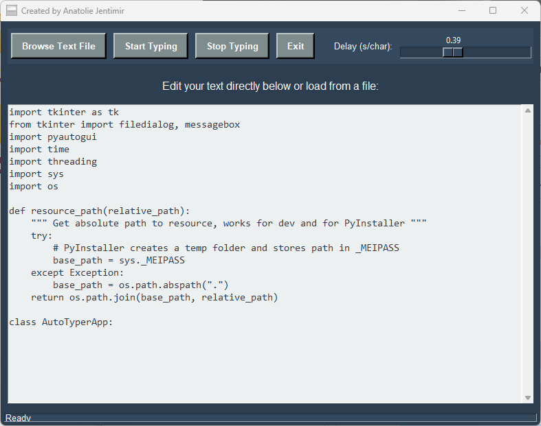

# ⌨️ AutoTyper GUI


> 🚀 A powerful Python GUI application for automating text input with precision speed control, file integration, and professional-grade reliability — perfect for developers, testers, content creators, and productivity enthusiasts.

---

## 🔽 Download

📦 **Latest release:**
➡️ [**Download AutoTyper (.exe)**](https://github.com/jentimanatol/AutoTyper/releases/latest)

💻 **View the source:**
🔍 [**Browse all releases**](https://github.com/jentimanatol/AutoTyper/releases)

### 📁 Clone the Project

```bash
git clone https://github.com/jentimanatol/AutoTyper.git
cd AutoTyper
python auto_typer_gui.py
```

### ⚠️ Windows Defender Notice

> On some systems, **Windows Defender** or other antivirus tools may flag the `.exe` as suspicious. This is a common false positive for apps built with **PyInstaller**.

- ✅ This executable was **automatically built and signed** in the [GitHub Actions](https://github.com/features/actions) environment.
- 🔒 No third-party or malicious code is present.
- 🧼 You can inspect the full source code [here](https://github.com/jentimanatol/AutoTyper).

If needed, you can safely add the `.exe` to Defender's allowed list, or build it yourself using the provided source.

---

## 🧾 About This Project

**AutoTyper GUI** is a professional text automation tool built with Python and Tkinter. It transforms repetitive typing tasks into effortless workflows, offering precise control over typing speed and seamless file integration. Perfect for:

- **Form filling** and data entry automation
- **Software testing** with consistent input data  
- **Content creation** with template-based workflows
- **Accessibility assistance** for users with mobility challenges
- **Productivity enhancement** across various applications

The app features a modern 3D interface, real-time controls, and intelligent error handling for reliable operation.

---

## 🚀 Features  

- ⌨️ **Smart Text Automation** - Character-by-character typing with configurable delays (0.01s - 1.0s)
- 📂 **File Integration** - Load and edit `.txt` files directly in the application
- 🎯 **Precision Control** - 5-second startup delay for perfect target positioning
- 🛑 **Real-time Management** - Start, stop, and pause with instant response
- 🎨 **Modern UI** - Professional 3D button effects with excellent readability
- 💾 **Portable Design** - Single executable, no installation required
- 🔒 **Safe Operation** - Multi-threaded architecture prevents UI freezing

---

## ⚙️ Installation

### 🔧 Python Dependencies

```bash
pip install pyautogui tkinter
```

### 🏗️ Build from Source

```bash
pip install pyinstaller
pyinstaller --onefile --windowed --icon=assets/app_icon.ico auto_typer_gui.py --add-data "assets;assets"
```

---

## ▶️ How to Use

1. **🚀 Launch** - Run `AutoTyper.exe` (no installation needed)
2. **📝 Prepare Content** - Type directly or load a `.txt` file
3. **⚙️ Configure Speed** - Adjust typing delay using the precision slider
4. **🎯 Execute** - Click "Start Typing" and switch to target application within 5 seconds
5. **🛑 Control** - Use "Stop Typing" to halt operation instantly

### 💡 Pro Tips
- Use **0.1s delay** for fast bulk typing
- Use **0.5s delay** for precise form filling
- Position cursor in target field before starting
- Keep commonly used text as `.txt` files for quick access

---

## 📸 Screenshots


*Clean, professional interface with intuitive controls*


*Seamless file loading with live editing capabilities*

---

## 🛠️ Technical Specifications

- **Language:** Python 3.10+
- **GUI Framework:** Tkinter (native Windows integration)
- **Automation Engine:** PyAutoGUI
- **Build System:** PyInstaller
- **Memory Usage:** ~30-50MB RAM
- **Platform:** Windows 10/11 (primary), Windows 8.1+ (compatible)

---

## 🗺️ Roadmap

- 🔗 **Global Hotkeys** - System-wide keyboard shortcuts
- 📊 **Usage Statistics** - Typing analytics and performance metrics
- 🌐 **Multi-language** - Internationalization support
- 📱 **Cross-platform** - macOS and Linux versions
- ☁️ **Cloud Sync** - Settings and template synchronization

---

## 🤝 Contributing

Contributions are welcome! Please feel free to submit pull requests, report bugs, or suggest features.

```bash
# Development setup
git clone https://github.com/jentimanatol/AutoTyper.git
cd AutoTyper
pip install -r requirements.txt
python auto_typer_gui.py
```

---

## 📃 License

This project is licensed under the MIT License - see the [LICENSE](LICENSE) file for details.

---

## 🙋‍♂️ Author

Developed by [Anatolie Jentimir](https://github.com/jentimanatol)

⌨️ **Automating productivity, one keystroke at a time**

---