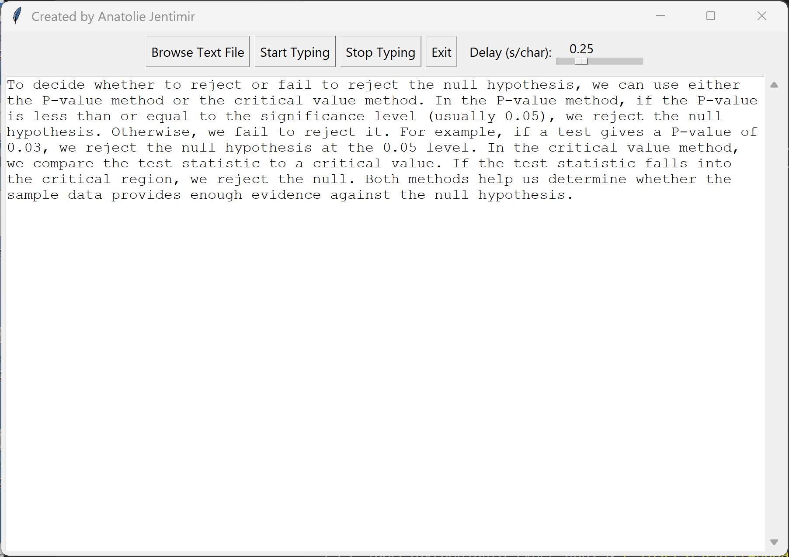
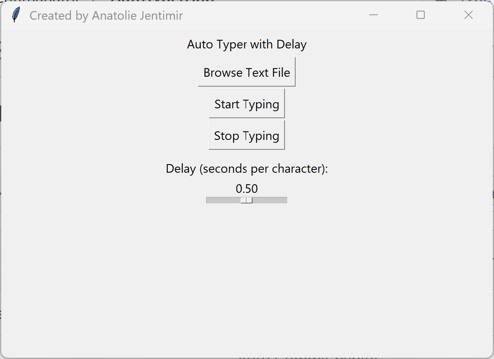

# 🧠 Auto Typer GUI


> Effortlessly automate typing with speed control, file browsing, and a user-friendly interface.

---

### 📦 Download the Latest Version


🔽 **[Download Auto Typer GUI v1.0 (.exe)](https://github.com/jentimanatol/AutoTyper/releases/download/v1.0/auto_typer_gui.exe)
**

📌 Or check for newer versions and souce code:  
👉 **[See all releases](https://github.com/jentimanatol/AutoTyper/releases)**

---

---

### ✨ Features

- 🖱️ Simple GUI with Start/Stop buttons
- ⏱️ Adjustable typing speed
- 📂 Load text from any `.txt` file
- ⌨️ Automatically types text with 0.5s delay between characters
- ✅ Lightweight and portable `.exe` with no Python installation required

---

### 🖼️ Screenshots






> Typing automation in action — simple, elegant, and distraction-free.


### 🛠️ How It Works

1. Open the app (`auto_typer_gui.exe`)
2. Click "Browse" to select a `.txt` file
3. Adjust the typing speed with the slider
4. Hit "Start" — typing begins after a short delay
5. Click "Stop" to pause typing any time

---

### 📁 Technical Details

- Built in Python with `PyQt5` and `PyAutoGUI`
- Compiled using `PyInstaller` into a single executable
- Icon embedded for a polished look

---

### 🤝 Contribute or Customize

Want to contribute, customize, or build your own version?  
Clone the repo and explore the source code.

```bash
git clone https://github.com/jentimanatol/AutoTyper.git
```


_Not protected by copyright, may be used for its intended purpose._  
_Author: Anatolie Jentimir._
