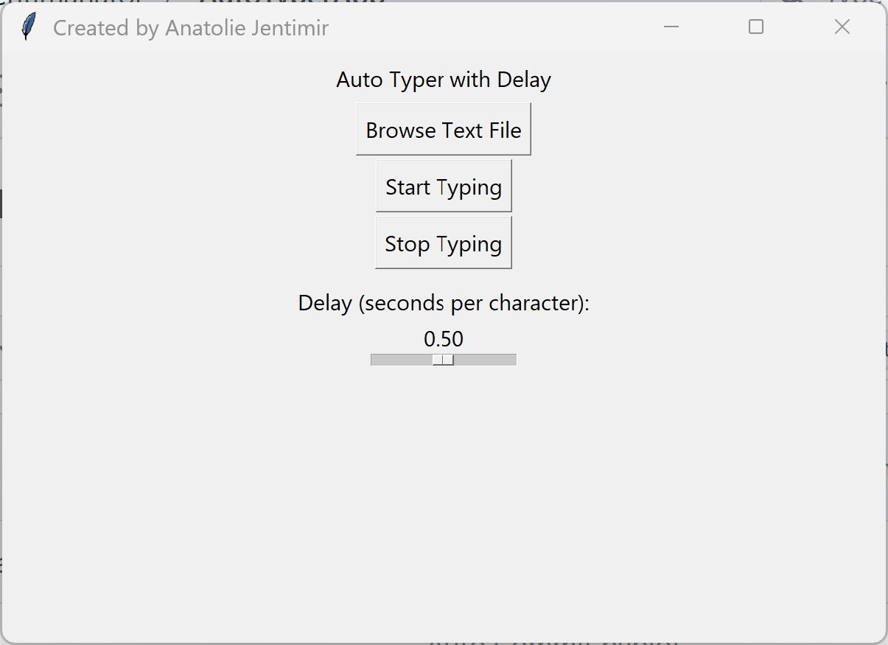

# 🤖 Auto Typer App – Python GUI Project

Welcome to the **Auto Typer App**, a sleek, Python-based desktop utility that simulates human-like typing for any text file you choose. Designed with intuitive controls, flexible speed settings, and a clean UI — this project showcases my ability to build practical, user-centric applications using Python, `Tkinter`, and automation libraries like `PyAutoGUI`.

---

## 🎯 Project Goals

> _“Type less. Do more.”_

This app was built to solve a real-world productivity problem: **automating repetitive typing tasks** for forms, testing, data input, or creative scripting. I wanted it to be user-friendly enough for non-programmers and robust enough for professionals — and fully standalone with no Python installation required.

---

## ✨ Features

| Feature                     | Description                                                                 |
|----------------------------|-----------------------------------------------------------------------------|
| 🔍 File Loader              | Browse and load any `.txt` file with a click                                |
| ⏱️ Adjustable Speed         | Fine-tune the delay between characters (0.01s to 1s)                         |
| ▶️ Start/🛑 Stop Controls    | Full control to pause or resume typing at any time                          |
| ⌛ Delayed Start            | Built-in 5-second countdown gives time to focus your cursor                 |
| 🧠 Threaded Execution       | Typing runs in a background thread to keep UI responsive                    |
| 🪄 Clean GUI with Tkinter   | Simple and elegant interface built with native Python                       |
| 📦 PyInstaller Compatible   | Fully bundled `.exe` for Windows – runs without Python installed            |

---

## 🖼️ Screenshots



> Typing automation in action — simple, elegant, and distraction-free.

---

## 🛠️ Tech Stack

- **Python 3.11+**
- **Tkinter** for GUI
- **PyAutoGUI** for keyboard automation
- **Threading** for non-blocking UI
- **PyInstaller** for packaging into `.exe`

---

## 🚀 Getting Started

### 🔧 Requirements (for development)
- Python 3.10+  
- `pip install pyautogui`

### 🏁 Run Locally
```bash
python auto_typer_gui.py
```

### 📦 Build `.exe` (Windows)
```bash
pyinstaller --onefile --windowed --icon=app_icon.ico auto_typer_gui.py
```
Find the `.exe` in the `dist/` folder.

---

## 🔐 Safety & Limitations

- Works **offline** — no data is sent anywhere
- Only types characters visible in your `.txt` file
- Use responsibly: this app simulates real keystrokes!

---

## 📂 Folder Structure

```
📁 AutoTyperApp/
├── auto_typer_gui.py
├── app_icon.ico
├── text_data.txt
├── README.md
├── requirements.txt
└── dist/
    └── auto_typer_gui.exe
```

---

## 💼 Portfolio Value

This project highlights:
- GUI development from scratch using native Python tools
- Event handling, threading, and user input management
- Real-world utility through desktop automation
- Packaging and deployment with PyInstaller

✅ **Perfect for demonstrating full-stack Python desktop development** in interviews or freelance portfolios.

---

## 📬 Let's Connect!

If you enjoyed this project or want to collaborate on more automation tools, feel free to reach out:

- 💻 [GitHub Portfolio](https://github.com/yourusername)
- 📫 [LinkedIn](https://www.linkedin.com/in/yourprofile/)
- 📧 your.email@example.com


_Not protected by copyright, may be used for its intended purpose._  
_Author: Anatolie Jentimir._
